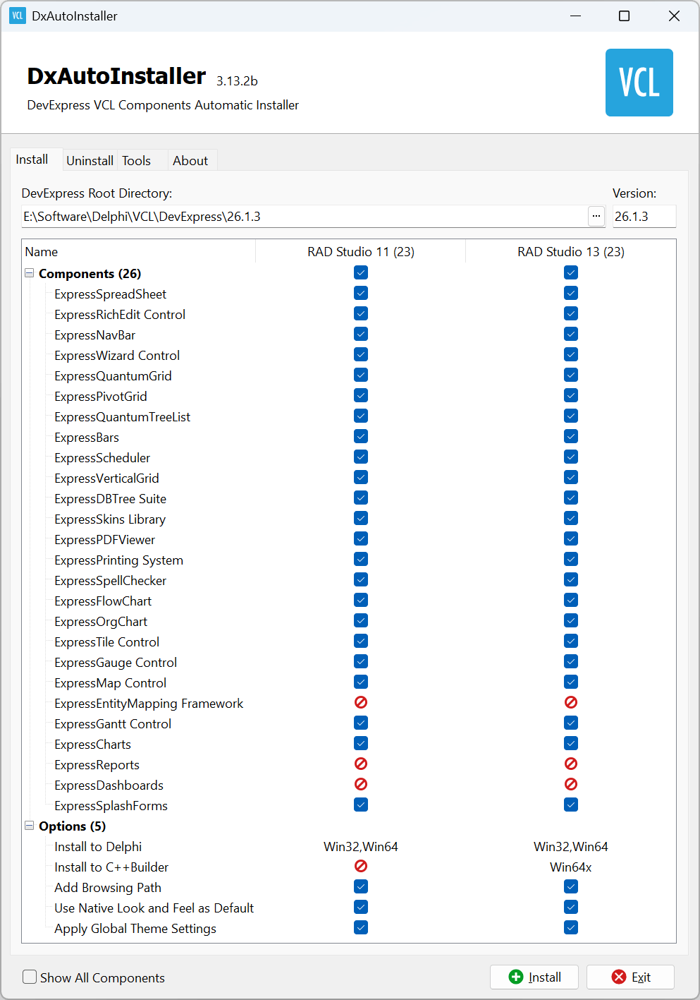

# DxAutoInstaller

**DevExpress VCL Components Automatic Installer**

DxAutoInstaller is an open-source tool that automates the installation (and uninstallation) of DevExpress VCL components into Delphi / RAD Studio and C++Builder.

## Features

- **One-click install / uninstall** — automatically compiles and registers the required DevExpress VCL packages, with a matching uninstall option.
- **Select components and IDE versions** — choose exactly which component groups to install and which installed IDE version(s) to target.
- **Target platform selection** — pick the Delphi/C++Builder target platforms to install for.
- **64-bit IDE support** — install into 64-bit Delphi / RAD Studio IDEs.
- **Win64x support** — install for C++Builder Windows 64-bit Modern (Win64x).
- **Automatic dependency resolution** — installing a component automatically installs any packages it depends on.
- **Manifest-driven** — installation rules are described in a `DevExpress.yaml` manifest file that is customizable.
- **Async install/uninstall** — runs on a background thread with a progress bar, elapsed time, and a log file for troubleshooting.

## Requirements

- The corresponding DevExpress VCL full-source package, extracted locally.
- A supported Delphi / RAD Studio / C++Builder installation.
- If DevExpress was previously installed manually or with another tool, uninstall it first to avoid conflicts.

## Basic Usage

1. Download the DxAutoInstaller from the [Releases page](../../releases) (separate x86 and x64 binaries are provided).
2. Run DxAutoInstaller.exe, then select the DevExpress root folder.
3. Select the components and target IDE version(s)/platform(s) you want, then start the install.
4. To remove the components, use the same tool's uninstall option.

> Note:  Run DxAutoInstaller.exe as Administrator if the install path is under a system directory or your IDE requires elevated permissions.

## Building from Source

DxAutoInstaller depends on the following third-party libraries and components:

- **[JCL (JEDI Code Library)](https://github.com/project-jedi/jcl)** — general-purpose utility library.
- **[VSoft.YAML](https://github.com/VSoftTechnologies/VSoft.YAML)** — parses the `DevExpress.yaml` manifest.
- **[DevExpress VCL](https://www.devexpress.com/products/vcl/)** — the IDE used to compile DxAutoInstaller must already have DevExpress VCL installed.

Once dependencies are set up, run `Bin\Build.bat` to build.

## Manifest File

Installation rules are defined in `DevExpress.yaml`, which lists each DevExpress package and its dependencies.

To support a DevExpress VCL version not covered by an official release, you can edit the manifest file to match the format used by your version.

## Feedback & Contributing

- Found a bug, or want support for a new DevExpress / RAD Studio version? Please open an [Issue](../../issues).
- Pull requests — code changes or manifest updates — are welcome.

## Disclaimer

This tool only automates the install/uninstall workflow for DevExpress VCL components; it does not provide or redistribute DevExpress products themselves. Make sure you hold a valid license for the components you install.
