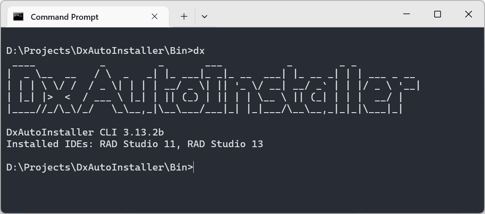

# DxAutoInstaller

**DevExpress VCL Components Automatic Installer**

DxAutoInstaller is an open-source tool that automates the installation (and uninstallation) of DevExpress VCL components into Delphi / RAD Studio and C++Builder. It's available in two editions:

- **GUI** (`DxAutoInstaller.exe`) — a visual, step-by-step installer.
- **CLI** (`dx.exe`) — a command-line tool for scripted, silent, CI/CD, or AI-tool installs.

Both editions share the same install/uninstall engine and manifest file, so they behave identically — only the interface differs.




## Features

- **One-click install / uninstall** — automatically compiles and registers the required DevExpress VCL packages, with a matching uninstall option.
- **GUI and CLI editions** — use the graphical installer for interactive setups, or the `dx` command-line tool for scripting and automated/CI pipelines.
- **Select components and IDE versions** — choose exactly which component groups to install and which installed IDE version(s) to target.
- **Target platform selection** — pick the Delphi/C++Builder target platforms to install for.
- **64-bit IDE support** — install into 64-bit Delphi / RAD Studio IDEs.
- **Win64x support** — install for C++Builder Windows 64-bit Modern (Win64x).
- **Automatic dependency resolution** — installing a component automatically installs any packages it depends on.
- **Manifest-driven** — installation rules are described in a `DevExpress.yaml` manifest file that is customizable.
- **Async install/uninstall** — runs on a background thread with a progress bar, elapsed time, and a log file for troubleshooting.
- **Non-interactive mode** — the CLI's `-y` / `--yes` flag auto-confirms prompts, making it suitable for unattended and CI/CD use.

## Requirements

- The corresponding DevExpress VCL full-source package, extracted locally.
- A supported Delphi / RAD Studio / C++Builder installation.
- If DevExpress was previously installed manually or with another tool, uninstall it first to avoid conflicts.

## Basic Usage (GUI)

1. Download DxAutoInstaller from the [Releases page](../../releases) (separate x86 and x64 binaries are provided).
2. Run `DxAutoInstaller.exe`, then select the DevExpress root folder.
3. Select the components and target IDE version(s)/platform(s) you want, then start the install.
4. To remove the components, use the same tool's uninstall option.

> Note: Run `DxAutoInstaller.exe` as Administrator if the install path is under a system directory or your IDE requires elevated permissions.

## Command Line Usage (CLI)

`dx.exe` exposes the same install/uninstall engine as the GUI, driven entirely from the command line — useful for scripting and unattended/CI setups.

```
dx <command> [IDE list] [options]
```

### Commands

| Command     | Description                                    |
| ----------- | ----------------------------------------------- |
| `install`   | Install DevExpress VCL components to IDEs       |
| `uninstall` | Uninstall DevExpress VCL components from IDEs   |

### Global options

| Option              | Description                                                     |
| -------------------- | ---------------------------------------------------------------- |
| `-v`, `--version`    | Show version information                                         |
| `-h`, `--help`       | Show help (add after a command, e.g. `dx install -h`, for command-specific help) |
| `-y`, `--yes`        | Automatically answer "yes" to all prompts (non-interactive mode) |

### `install` options

| Option                    | Description                                                        |
| -------------------------- | -------------------------------------------------------------------- |
| `[IDE list]`               | Target IDE(s), e.g. `RAD Studio 13`, `RS13`, `RADStudio13`. If omitted, all installed IDEs are targeted. |
| `-d`, `--rootdir=<path>`   | Specify the DevExpress root directory. Defaults to the current directory if omitted. |

### `uninstall` options

| Option        | Description                                                        |
| -------------- | -------------------------------------------------------------------- |
| `[IDE list]`   | Target IDE(s), e.g. `RAD Studio 13`, `RS13`, `RADStudio13`. If omitted, all installed IDEs are targeted. |

### Examples

```bat
:: Show version / usage
dx --version
dx --help
dx install --help

:: Install into all installed IDEs, using the current directory as the DevExpress root
dx install

:: Install into a specific IDE, with an explicit DevExpress root directory
dx install "RAD Studio 13" -d="C:\DevExpress\VCL"

:: Install into multiple IDEs, auto-confirming any prompts (CI/CD friendly)
dx install "RS13,RS12" -y

:: Uninstall from a specific IDE
dx uninstall "RS13"
```

> Note: Run `dx.exe` as Administrator if the install path is under a system directory or your IDE requires elevated permissions.

## Building from Source

DxAutoInstaller depends on the following third-party libraries and components:

- **[JCL (JEDI Code Library)](https://github.com/project-jedi/jcl)** — general-purpose utility library.
- **[VSoft.YAML](https://github.com/VSoftTechnologies/VSoft.YAML)** — parses the `DevExpress.yaml` manifest.
- **[VSoft.CommandLineParser](https://github.com/VSoftTechnologies/VSoft.CommandLineParser)** — parses command-line options for the CLI (`dx.exe`).
- **[DevExpress VCL](https://www.devexpress.com/products/vcl/)** — required only for the GUI edition; the IDE used to compile `DxAutoInstaller.exe` must already have DevExpress VCL installed. The CLI (`dx.exe`) does not depend on it.

The repository contains two projects sharing the same core sources:

- `DxAutoInstaller.dproj` — builds the GUI (`DxAutoInstaller.exe`).
- `dx.dproj` — builds the CLI (`dx.exe`).

Once dependencies are set up, run `Bin\Build.bat` to build both.

## Manifest File

Installation rules are defined in `DevExpress.yaml`, which lists each DevExpress package and its dependencies. Both the GUI and CLI editions read the same manifest file.

To support a DevExpress VCL version not covered by an official release, you can edit the manifest file to match the format used by your version.

## Feedback & Contributing

- Found a bug, or want support for a new DevExpress / RAD Studio version? Please open an [Issue](../../issues).
- Pull requests — code changes or manifest updates — are welcome.

## Disclaimer

This tool only automates the install/uninstall workflow for DevExpress VCL components; it does not provide or redistribute DevExpress products themselves. Make sure you hold a valid license for the components you install.
